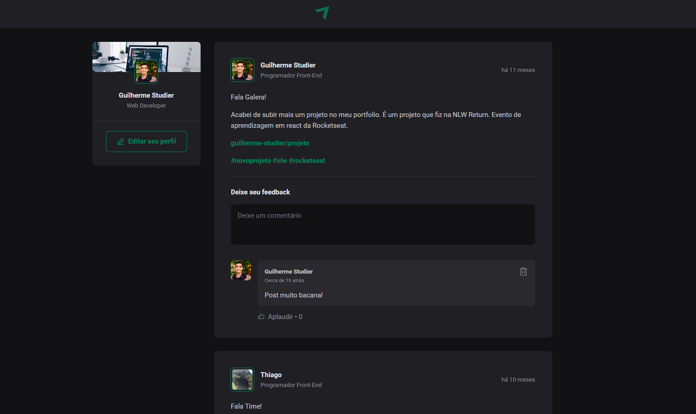

<!-- Title -->
<h1 align="center"> RocketSeat 🔥 Ignite ReactJS </h1>

<!-- Subtitle -->
<h2 align="center"> Módulo 1 - Fundamentos do React ( Ignite Feed ) </h2>

<!-- Sobre o Projeto -->
## 🚀 Sobre o Projeto
Ignite feed é um projeto simples que simula o feed das redes sociais, com funcionalidades de comentários, likes e apagar comentário. 

## 🖼️ Imagens do Projeto
<div align="center">
  
</div>

## 🧰 Tecnologias e Bibliotecas

* [ReactJS](https://pt-br.reactjs.org/tutorial/tutorial.html)
  * [Styled Component](https://www.npmjs.com/package/styled-components) - Biblioteca CSS in JS
  * [React Modal](https://www.npmjs.com/package/react-modal)
* [TypeScript](https://www.typescriptlang.org/)


## ⚙️ Rodando o Projeto
```bash
# Clone este repositório para a pasta anterior
$ git clone https://github.com/guilherme-studier/react-ignite-feed.git
# ou use a opção de download.

# Instale as dependências
$ yarn install
ou
$ npm install

# Executando o Projeto
$ yarn dev 
ou
$ npm dev

# Acesse http://localhost:3000 no seu navagador
```
